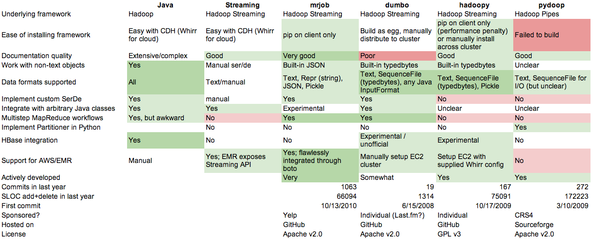

.. Stock Price Movement Prediction Using Mahout and Pydoop documentation master file, created by
   sphinx-quickstart on Fri Dec 19 10:16:29 2014.
   You can adapt this file completely to your liking, but it should at least
   contain the root `toctree` directive.

Stock Price Movement Prediction Using Mahout and Pydoop's Website for Big Data Analytics course Fall 2014 Columbia University
===================================================================================

Abstract
================

Efficient market hypothesis first made popular by methods introduced by BARRA, suggests stock prices follow a random walk that could be explained via Brownian motion techniques. Stock market prediction is the act of trying to determine the future value of a company stock or other financial instrument traded on an exchange that follows such motion.  Our goal for this project is to use open-source machine learning techniques and high performance computing tools (Hadoop with Mahout and pydoop&scikit-learn) in order to predict movements of stocks (specifically Home Depot stocks) over various periods of time (10, 20, 30 year periods). This paper explains differences in the development process, accuracy, and performance of using these different frameworks as well as challenges. As a result, we will be able to provide a comparison for those, who are interested in putting high-performance prototypes together that use Hadoop and its tools for similar stock price prediction applications as well as portfolio risk management. 

Demo
=================

Please refer to the following link to see our application in action:  
https://www.youtube.com/watch?v=0Rafkql5UH0

Mahout
==================

Predicting stock price movement is commonly used in the investment field. The basic idea of this prediction is using the historical data to predict the next following days’ price will go higher or lower. This topic is related to big data course is based on the following aspect: Firstly, we need the training data to build the prediction model, in order for the accuracy, the large amount of data is required. Based on the fact of time consistency of stock price and the frequency of updating, we are able to find dataset that is suitable for prediction model. The dataset used in this project is from yahoo finance. In order to state the problem, HD and IBM datasets are used and it contains different time periods and frequency to test the functionality of our prediction model, from 1984 to 2014, 2004 to 2014,2011 to 2014, 2013 to 2014, based on different frequency as data are collected as daily, weekly, monthly.

Description of Method
    Mahout provides a package for linear regression: org.apache.mahout.classfier.sgd.TrainLogistic. This package allows user to generate a model via training data and then apply the generated model to testing data in order to calculate the accuracy and achieve other related technical results.
    A prediction model (i.e. a linear hypothetical function) is built based on information of a stock’s opening price, highest price, lowest price and closing price (OHLC) in order to achieve higher accuracy. That’s the reason we choose datasets from Yahoo Finance which have enough information we need.
 
Preprocessed steps
    1. Set up the path:
        export MAHOUT_HOME=${user’s path to mahout-trunk}/mahout-trunk/bin
        export MAHOUT_CONF_DIR=${user’s path to mahout-trunk}/mahout-trunk/src/conf
    2. Build the working directory:
        export WORK_DIR=${user’s path to Workdir}
        mkdir -p ${user’s path to Workdir}
    3. Select predictors and target values:
        Predictor values are selected as input to train the model. As mentioned above, opening price, highest price, lowest price and closing price (OHLC) are chosen while ignoring dates and volumes. The predictor values are decided via trials with different variations. And higher accuracy can be got with OHLC.
        Target value is created to predict the next day’s price by comparing one day’s close price and the next following day’s open price, indicates the price will be “Lower” or “Higher”. “Lower” means next day’s open price is no bigger than current day’s close price, while “Higher” means next day’s open price is bigger than current day’s close price. Target values are added by Excel easily using a simple formula: =IF(E2>=B3, ‘Lower’, ‘Higher’), where E2 is current day’s close and B3 is next day’s open.

Running steps
    1. Split the preprocessed dataset and create a 90% percent of training set and a 10% percent of testing set, the command line is as following:
        mahout-trunk/bin/mahout splitDataset --input Datadir/table.csv --output Workdir/table_train --trainingPercentage 0.9 --probePercentage 0.1
    
    2. Convert dataset of training set to sequence file, the command line is as following:
        mahout-trunk/bin/mahout seqdirectory -i Workdir/table_train/trainingSet -o Workdir/sequence/train -c UTF-8 -chunk 64 -xm sequential
    
    3. Convert sequence file of training set to csv file, the command line is as following:
        mahout-trunk/bin/mahout seqdumper -i Workdir/sequence/train -o Workdir/table_train.csv
    
    4. The command lines for processing testing data are similar to step 2 and 3.
        
      
    5. Then here is the command line to generate the model:
        mahout-trunk/bin/mahout org.apache.mahout.classifier.sgd.TrainLogistic --passes 100 --rate 1 --lambda 0.0001 --input Workdir/table_train.csv --features 21 --output Workdir/stock.model --target nextday_price_dir --categories 2 --predictors Open High Low Close --types n n
    
    6. Finally, here is the command line to test the model:
        mahout-trunk/bin/mahout org.apache.mahout.classifier.sgd.RunLogistic --input Workdir/table_test.csv --model Workdir/stock.model --auc --scores --confusion

Pydoop
==================

Jython and CPython are two different implementations of Python language. Even though Python language exists as a standalone framework, there are fundamental differences between its C/C++ and Java backends. Python became mainstream in early 90s as an effort to replicate Matlab-like software, providing a free and open-source option. Given the maturity of C/C++ and its widespread use in scientific community at the time, most scientific Python packages are implemented using CPython. This is partly due to the fact that C/C++ provide better performance than Java for scientific use. Since CPython dominates the scientific community, its stack of scientific tools is much larger and mature compared to Jython. 
Hadoop provides various application programmer interfaces(APIs) for various languages including C, C++, Java, Pyhon. Since Hadoop is implemented in Java, the API provided by Hadoop community is Jython based. This is a limiting factor for implementing a project in Python on Hadoop that incorporates machine learning concepts given the lack of tools that are available for such use in Jython. Our research for finding a Python library/toolkit for implementing the stock price movement prediction application resulted in the following choices: Hadoop Streaming, Dombo, Pydoop, Hadoopy, and mrjob. 

In order to qualify these tools for our use, we determined the requirements for our application and investigated similar applications that have been implemented by various individuals. We decided to use scikit-learn for the machine learning tools our application requires. This was our best option given the language for reasons we explain later in this report. Scikit-learn is a third party library with various dependencies that are also third party libraries with C/C++ base(Numpy, Scipy, and Matplotlib). Our primary goal was to choose a Python API that would allow us to use these third party libraries alongside standard Python packages. We found out that these libraries were supported via pydoop as its underlying framework was Hadoop pipes. Hadoop provides pipes to C/C++ among its native APIs that C/C++ processes can communicate and run on Hadoop framework. Pydoop provides a wrapper around Hadoop pipes via Boost providing a clean and native CPython environment for development. A massive advantage of Pydoop over other Python Hadoop APIs is its ability to provide separation between HDFS and MapReduce. Pydoop provides a Python HDFS API, which is not available in other solutions. If used effectively, Hadoop’s distributed file system can be utilized for various parallel processing applications that do not necessarily use Hadoop’s YARN. Another extremely crucial factor was Python version these possible APIs supported. Pydoop was able to provide us with the support required since it supports every Hadoop version from v1.1 to v2.5.1.

    As mentioned earlier, we selected scikit-learn as the python library to perform supervised machine learning tasks required for our project. We evaluated various other tools for the same purpose including StatsModels, PyMC, Shogun, Gensim, Orange, and PyMPVA. We selected scikit-learn among these possible solutions because of its simple api, performance, and very wide user base. Based on the personal experience of the group members, we also knew that scikit-learn was extremely well integrated with mainstream 3rd party applications such as pandas, scipy, numpy, and matplotlib, which has extensive use and various functionalities that make Python attractive in the first place. 

        Installation for these tools was quite straightforward on Ubuntu environment while they posed quite a few issues in Mac OS X. For instance, the compiler options for wrapped Boost libraries were not compatible with Mac OS X as the version of clang did not support these options yet. This is understandable as these packages are fairly new(~4 years) and are developed on debian based environments. In order to keep the hardware configuration uniform compared to our mahout solution, we used the virtual machine provided by the course. This resulted in a smooth set of installations of our development environment. 

We used the identical technique to Mahout version(please see earlier in this report), in order to perform the supervised machine learning techniques required. Scikit-learn provides SGDClassifier methods via sklearn.linear_model. We used 90% of the data as training set and 10% of the data for testing our findings. As the demo specific to pydoop version in the following link displays(https://www.youtube.com/watch?v=R3zVC7mFzDA&feature=youtu.be), we were able to run our model and test its validity, comparing it to Mahout version. As we discuss in the conclusion, our results were consistent. 
    
    Our experience using Pydoop and scikit-learn was somewhat mixed. The most challenging part was being able to parse the information into numpy arrays. Pydoop’s hdfs interface provided us with the ease of use required, however not-so well documented object oriented mapreduce implementation did complicate our implementation. Based on our experience, we would like to try mrjob instead of pydoop and implement the SGD application ourselves instead of using SGD class from scikit-learn. Although more complicated, this would more likely yield in smoother product development. This version, however, would require more time and effort than the current one, possibly turning into a semester long project by itself.`

Results
==================
Influence of Prediction Accuracy
    Different datasets may be applied by using our prediction model, but it will need some adjustments on training data parameters, such as the portion of training data and testing data. The case stated above has the best output result with the parameters. And data frequency and period will also affect the accuracy outputs.
    
    With higher frequency of sample data, our model can predict more accurate prediction. Thats because the model is built based on more data.
    
    The influence of time length is complex. First of all, 1-year data is extremely unreliable due to its limited amount of data, which causes contingency of the result. Secondly, 30-year data is less reliable than medium-term data. Thats because there are huge changes in both company and market. Thus, the result will be less accurate. Finally, 10-year data is optimal because it has sufficient data as well as relatively new data compared to 30-year data.

Analysis on Prediction Result
    The result of prediction on dataset ”HD-2004-2014-d” is shown below. 
    
    AUC = 0.85
    confusion: [[138.0, 52.0], [17.0, 80.0]]
    entropy: [[-0.6, -0.7], [-0.9, -0.6]]
    
    The actual data have 155 lower prices and 132 higher prices. The confusion matrix shows that our testing result has 138 matches lower prices and 80 matches higher prices. And accuracy of this model is 0.85, which is a relatively high accuracy. It means that the model is relatively reliable.

References
==================
Mahout in Action(2010) Sean.Owen

https://www.youtube.com/watch?v=Yo9BaCptZN8

http://bickson.blogspot.com/2011/01/mahout-on-amazon-ec2-part-2-testing.html

http://blog.cloudera.com/blog/2013/01/a-guide-to-python-frameworks-for-hadoop/

http://pydoop.sourceforge.net/docs/index.html

http://scikit-learn.org/stable/modules/sgd.html

https://www.cbinsights.com/blog/python-tools-machine-learning/

Indices and tables
==================

* :ref:`genindex`
* :ref:`modindex`
* :ref:`search`

